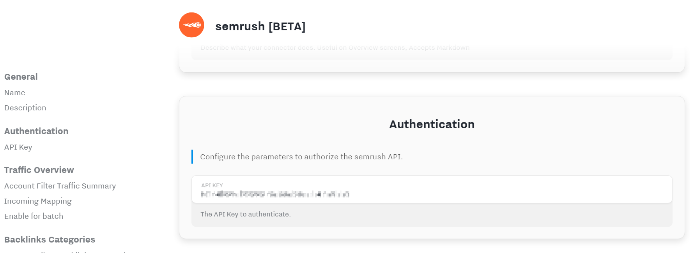
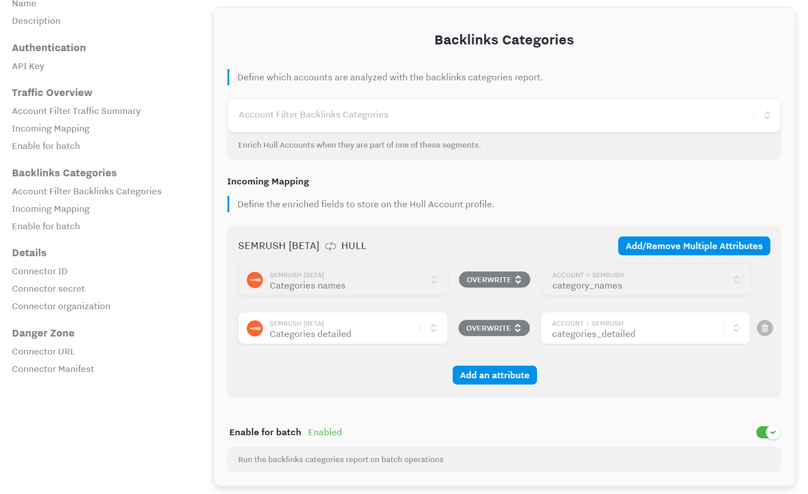

# Semrush [BETA]

The Hull Connector for Semrush allows you to run analytics reports from Semrush and enrich your profile data with the results.

> This connector is under active development, features are subject to change and the documentation might not be complete yet.

## Getting Started

1. From your Hull Connectors page click on **Add a Connector**.
2. Search for "Semrush" and click on **Install**
3. Authorize Hull to connect with the Semrush API by entering the api key:
   

## Available Reports

The connector allows you to run several reports from Semrush to enrich your profile data in Hull. You can control which reports to run by specifying one or more segments in the respective Account Filter setting.

### Traffic Summary

The description _is not available yet_.

### Backlinks Categories

The backlinks categories report allows you to retrieve categories with ratings for a given Hull account profile by domain.
You can retrieve a list of strings for the category names as well as a more complex list of names with ratings:

Please note that you cannot use the more complex object directly for segmentation purposes, but you can transform it further using the Account Processor.

If you activate **Enable on batch** in this section, the backlings categories report will be executed for every account you send manually to the connector.

## FAQ

### When is a profile being enriched

The connector receives updates from the Hull platform if anything on a given user or account profile changes and then almost immediately calls the Semrush API if the profile matches one of the whitelisted segments for the respective report.
This means in most cases the Semrush results will be available within a few minutes.

### How can I enrich data manually

You can enrich data manually by sending accounts to the Semrush connector any time. Please keep in mind that the Semrush connector will run all reports which have the respective **Enable on batch** setting activated, so it is recommended that you verify those settings before sending data. If you want to reduce the risk of executing many reports on manual operations, it is recommended to deactivate the respective setting again after you sent your manual batch.
